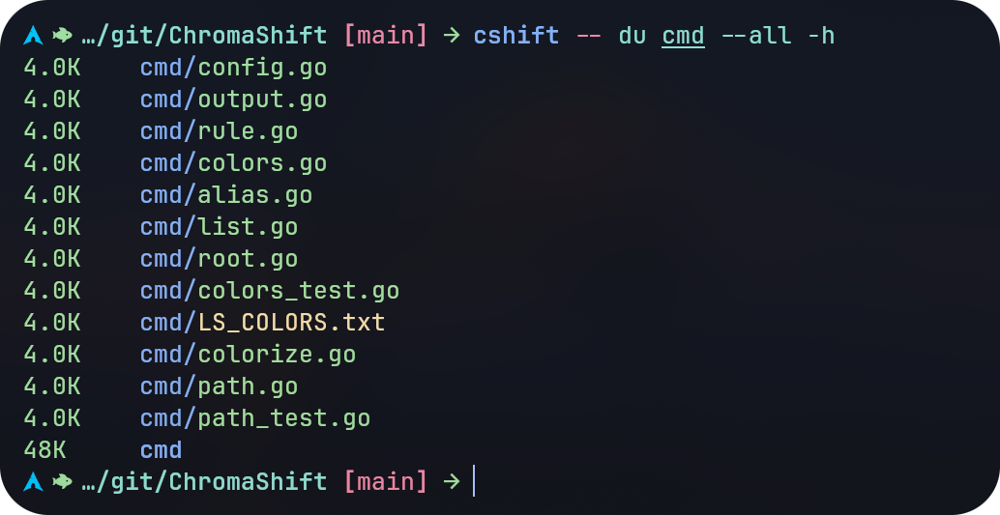

# ChromaShift

A output colorizer for your favorite commands.



## Installation

### Arch User Repository (AUR)

```bash
yay -S chromashift
```

Or,

```bash
yay -S chromashift-git
```

### Pre-Build Binary

Download pre-build binary from
[release](https://github.com/Nadim147c/ChromaShift/releases).

### Build from source

```bash
git clone https://github.com/Nadim147c/ChromaShift.git
cd ChromaShift
make
sudo make install PREFIX=/usr
```

## Usage

Simply run your favorite commands through ChromaShift to see the output in enhanced
colors. For example:

```bash
cshift -- <your-command>
```

List of available command can be found in [config.toml](./config.toml) file.

## Contribution

If your favorite command is not supported yet, feel free to create an
[issue](https://github.com/Nadim147c/ChromaShift/issues). If you want to contribute
your rules for any specific command, follow the guide below.

## Creating a New Rule

To create your own colorization rules, you’ll need a basic understanding of regular
expressions (regex). Let’s walk through an example where you want to create a
colorization rule for the `du` command (note: a rule for `du` already exists).

1. First, create the configuration file if it doesn’t exist:

   ```sh
   mkdir -p ~/.config/Chromashift
   touch ~/.config/Chromashift/config.toml
   ```

   Then, add an entry in the configuration file located at
   `~/.config/Chromashift/config.toml` like this:

   ```toml
   [du]
   regexp = '^([/\w\.]+/)?du\b'
   file = 'du.toml'
   ```

   Here's how it works: `ChromaShift` first checks if the command name matches `du`
   exactly, then loads the corresponding `du.toml` file to apply the colorization
   rules. If it doesn’t find a direct match, it uses the specified `regexp` to check
   the command. This means running `cshift -- /usr/bin/du` will also work as
   expected.

2. Next, create a TOML file in `~/.config/Chromashift/rules/`. The file name should
   match what you specified in `config.toml`, in this case, `du.toml`:

   ```sh
   mkdir -p ~/.config/Chromashift/rules
   touch ~/.config/Chromashift/rules/du.toml
   ```

3. For schema validation, add the following line to the top of your TOML file:

   ```toml
   "$schema" = '../rule.schema.json'
   ```

   This ensures that the rules you define will be validated according to the schema,
   providing helpful feedback as you work on them.

4. **How do rules work?**

   Each rule is defined as an array block within the TOML file. Here's an example of
   a rule for highlighting totals:

   ```toml
   [[rules]] # Total
   regexp = '(.*)\s+(total)$'
   colors = ',bold yellow bgblue'
   ```

   In this example:
   - `regexp` is the regular expression that matches the text you want to style.
   - `colors` specifies the styles to apply. You can use multiple styles by
     separating them with spaces (e.g., `bold yellow bgblue` applies bold yellow text
     with a blue background).

   If you want to apply different styles to different capture groups in your regex,
   separate the styles with a comma (`,`).

   ```toml
   [[rules]] # Destination
   regexp = '^\[download\] (Destination): (.*)'
   colors = ',yellow,path'
   ```

   In this rule:
   - The word "Destination" is colored yellow.
   - The second group (anything that comes after "Destination") is colored using
     path. The path is special color because it looks the file permission and your
     `LS_COLORS` variable to style the selected group.

5. **More Options:**
   - `pty`: Executes the command inside a pseudo-terminal (pty).
   - `stderr`: Colors the output of stderr instead of stdout.
   - `rules.overwrite`: Overwrites a matching rule if another rule applies to the
     current line.
   - `rules.priority`: Sets the priority for a rule if multiple rules match a line.

## Contributing Your Rule

If you want to share your rule with the community, add it to the official ChromaShift
repository. To do this:

1. Copy your rule file to the repository’s `rules/` directory.
2. Update the repository's `config.toml` accordingly.
3. Submit a pull request.

By following these steps, you can easily create new colorization rules for any
command!

## LICENSE & CREDIT

ChromaShift is licensed under the [GNU-GPL-3](./LICENSE). Most of its features have
been shamelessly stolen from [garabik/grc](https://github.com/garabik/grc).
